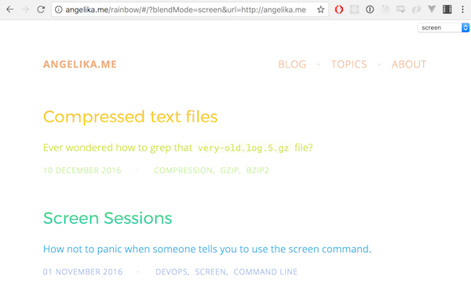

# Rainbow

Put a rainbow gradient over a website in an iframe.

A demo of `mix-blend-mode` property of HTML elements, written for this [blog post](https://angelika.me/2017/05/07/blend-mode-in-css/).

Based on [tsaiDavid/simple-redux-boilerplate](https://github.com/tsaiDavid/simple-redux-boilerplate).
